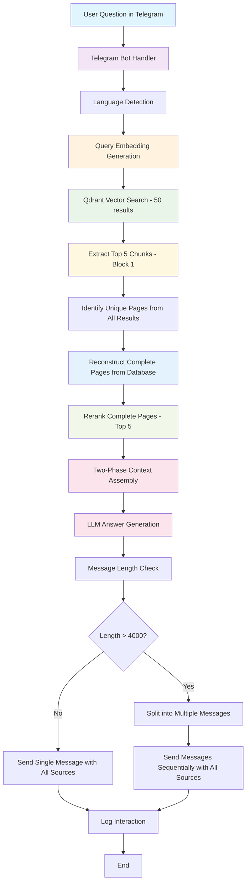

# QA Telegram Bot Architecture

## System Overview

The QA Telegram Bot uses a **Two-Phase RAG (Retrieval-Augmented Generation)** pipeline to answer questions based on scraped website content stored in Qdrant vector database. The new approach combines both chunk-level and page-level context for enhanced answer quality.

## Architecture Flow



## Key Components

### 1. Two-Phase RAG Service
- **Vector Search**: Retrieves 50 most similar chunks from Qdrant
- **Phase 1 - Top Chunks**: Extracts top 5 chunks for immediate context (Block 1)
- **Phase 2 - Page Reconstruction**:
  - Identifies unique pages from all 50 search results
  - Fetches ALL chunks for each identified page from database
  - Reconstructs complete pages ordered by `chunk_index`
  - Reranks complete pages to select top 5 (Block 2)
- **Two-Phase Context Assembly**: Creates distinct blocks with clear separation

### 2. LLM Services
- **Embedding**: `dengcao/Qwen3-Embedding-0.6B:Q8_0`
- **Reranker**: `dengcao/Qwen3-Reranker-4B:Q4_K_M` (now processes complete pages)
- **Generator**: `qwen3:4b`

### 3. Data Structure (from embedder.py)
```json
{
  "filename": "page_001.md",
  "chunk_index": 0,
  "content": "Full chunk content...",
  "page_info": "Page 142",
  "url": "https://example.com/page",
  "content_preview": "First 500 chars..."
}
```

### 4. Language Handling
- Detect Russian input using language detection
- Respond in Russian when user writes in Russian
- Use Russian message templates from constants

### 5. Enhanced Source Attribution
- **No Deduplication**: Shows ALL sources from both chunks and complete pages
- **Dual Scoring**: Displays both vector search scores (0.5-0.8) and rerank scores (9-10)
- **Complete Transparency**: Users see exactly which chunks and pages contributed
- **Format**: `1. URL (score: X.XXX)` for each source

### 6. Logging Strategy
- Log all 50 vector search results with similarity scores
- Log top 5 chunks selection for Block 1
- Log page reconstruction process (chunks fetched per page)
- Log complete page reranking decisions with URLs and relevance scores
- Track embedding generation performance
- Monitor two-phase context assembly and response generation times